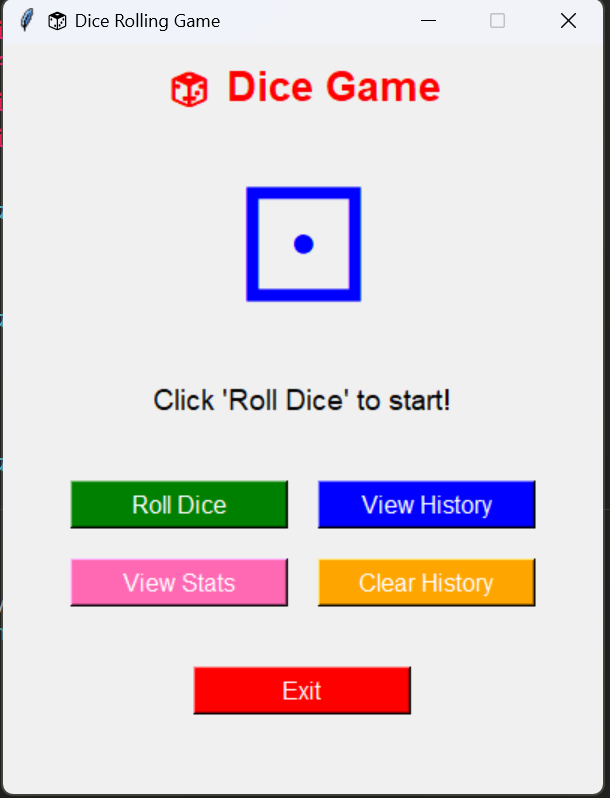
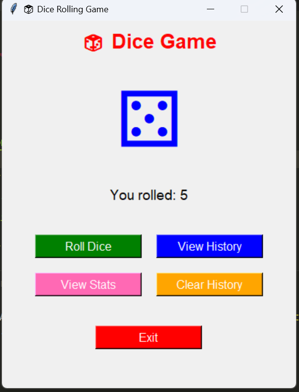
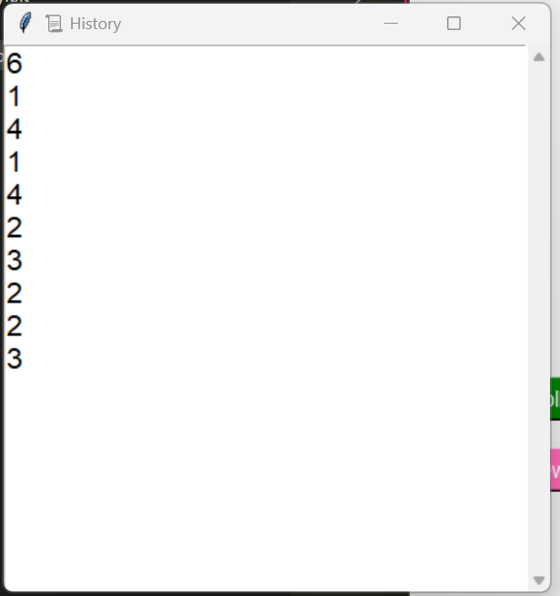
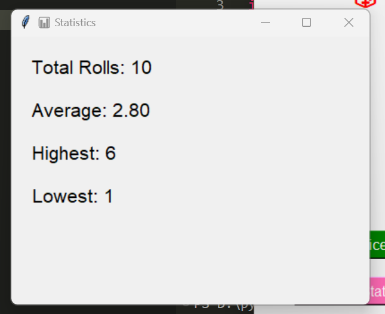
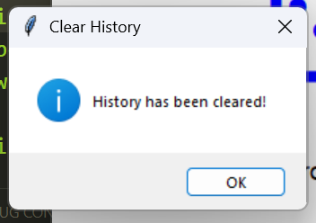

# 🎲 Dice Rolling Game

A **Python GUI application** that simulates rolling a dice. Users can roll the dice, view their roll history, check statistics, and clear history. Built using **Tkinter**, this app is interactive, user-friendly, and perfect for demonstrating Python GUI skills.

---

## 📌 Features

- Roll a single die with visual dice face (⚀–⚅)  
- View all previous rolls in a scrollable **History** window  
- View **Statistics**: total rolls, average, highest, and lowest values  
- **Clear History** button to reset saved rolls  
- **Exit** button to close the app  
- Clean GUI layout with buttons organized using `grid()`  

---

## ⚙️ Installation & Requirements

### 1. Install **Python 3.10+** from [python.org](https://www.python.org/downloads/)  

### 2. Clone the repository:

```bash
git clone https://github.com/Muhammad-Ali-Software-Engineer/dice-rolling-game.git
```
### 3. Navigate to folder
```bash
cd dice-rolling-game
```

### 4. Run the program
```bash
python main.py
```

---

## 🖥️ Screenshots

**Main Game Window**  


**Dice Rolled Example**  


**History Window**  


**Statistics Window**  


**Exit Button**  


---

## 📝 How to Play

1. Launch the app by running `python main.py`.  
2. Click **Roll Dice** to roll a die.  
3. Use **View History** to see all previous rolls.  
4. Click **View Stats** to see total rolls, average, highest, and lowest values.  
5. Click **Clear History** to reset all saved rolls.  
6. Click **Exit** to close the application.

---

## 🏆 Author
- Developed by <b>Mr. Muhammad Ali - BS Software Engineering Student</b>

- **GitHub:** https://github.com/Muhammad-Ali-Software-Engineer

- **Linkedin:** https://linkedin.com/in/Muhammad-Ali-Software-Engineer

>Note: This project was the part of python programming internship at Arch Technologies a remote IT Consulting comapny.

---

## 📝 License
This project is licensed under the MIT License.
